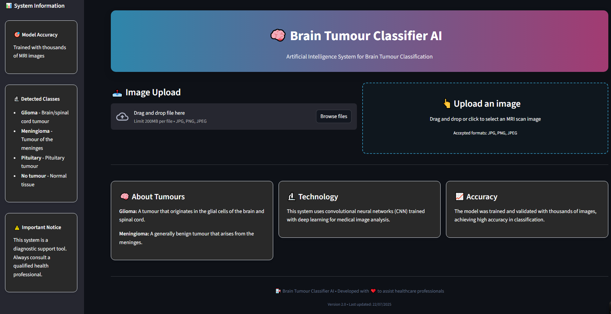

# 🧠 Brain Tumor Classifier AI


A sophisticated AI-powered web application for brain tumor classification using deep learning and medical image analysis.

## 🌟 Features

- **Multi-class Classification**: Detects 4 types of brain conditions:

  - Glioma (brain/spinal cord tumors)
  - Meningioma (meninges tumors)
  - Pituitary tumors
  - Normal tissue (no tumor)

- **Interactive Web Interface**: Modern, responsive UI built with Streamlit
- **Real-time Analysis**: Fast image processing and classification (< 1 second)
- **Detailed Results**: Confidence scores, probability distributions, and visual charts
- **Professional Design**: Custom CSS styling with animations and responsive layout

## 🚀 Demo



## 📋 Prerequisites

Before running the application, ensure you have:

- Python 3.8 or higher
- A trained Keras model file (`brain_tumour_model.keras`)
- Required Python packages (see requirements.txt)

## 🛠️ Installation

1. **Clone the repository**

   ```bash
   git clone https://github.com/yourusername/BrainTumourApp.git
   cd BrainTumourApp
   ```

2. **Create a virtual environment**

   ```bash
   python -m venv BrainTumourApp_env
   source BrainTumourApp_env/bin/activate  # On Windows: BrainTumourApp\Scripts\activate
   ```

3. **Install dependencies**

   ```bash
   pip install -r requirements.txt
   ```

4. **Add your trained model**
   - Place your trained Keras model file as `brain_tumour_model.keras` in the root directory

## 🏃‍♂️ Usage

1. **Run the application**

   ```bash
   streamlit run app.py
   ```

2. **Access the web interface**

   - Open your browser and navigate to `http://localhost:8501`

3. **Upload and analyze**
   - Upload an MRI scan image (JPG, PNG, JPEG)
   - View real-time classification results
   - Analyze confidence scores and probability distributions

## 📦 Dependencies

```txt
streamlit>=1.28.0
tensorflow>=2.13.0
numpy>=1.24.0
pillow>=10.0.0
plotly>=5.15.0
base64
datetime
```

## 🏗️ Project Structure

```
BrainTumourApp/
├── app.py                 # Main Streamlit application
├── brain_tumour_model.keras # Trained model file (add your own)
├── requirements.txt       # Python dependencies
├── README.md             # Project documentation
└── assets/               # Images and resources (optional)
```

## 🎯 Model Architecture

The application uses a Convolutional Neural Network (CNN) trained on medical imaging data:

- **Input**: 224x224 RGB images
- **Architecture**: Deep CNN with multiple convolutional and pooling layers
- **Output**: 4-class classification with probability scores
- **Training Data**: Thousands of MRI brain scan images

## 📊 Performance Metrics

- **Accuracy**: High classification accuracy on validation data
- **Speed**: < 1 second inference time
- **Reliability**: Confidence scoring for prediction reliability
- **Robustness**: Handles various image formats and sizes

## ⚠️ Important Disclaimer

**This application is intended for educational and research purposes only. It should not be used as a substitute for professional medical diagnosis. Always consult qualified healthcare professionals for medical advice.**

## 🔧 Customization

### Adding New Classes

To add new tumor types:

1. Retrain your model with additional classes
2. Update the `classes` list in the `main()` function
3. Adjust the color scheme in `create_probability_chart()`

### Styling

Customize the appearance by modifying the CSS in `load_custom_css()`:

- Colors: Update CSS variables at the top
- Layout: Modify container styles
- Animations: Add or modify keyframe animations

## 🐛 Troubleshooting

**Model Loading Error**

- Ensure `brain_tumour_model.keras` is in the root directory
- Check TensorFlow compatibility with your model

**Image Upload Issues**

- Verify image format (JPG, PNG, JPEG)
- Check file size limits
- Ensure image is not corrupted

**Performance Issues**

- Consider using GPU acceleration for faster inference
- Optimize image preprocessing pipeline

## 🤝 Contributing

1. Fork the repository
2. Create a feature branch (`git checkout -b feature/BrainTumourApp`)
3. Commit your changes (`git commit -m 'Add some BrainTumourApp'`)
4. Push to the branch (`git push origin feature/BrainTumourApp`)
5. Open a Pull Request

## 📄 License

This project is licensed under the MIT License - see the [LICENSE](LICENSE) file for details.

## 👥 Authors

- **Wolfler Guzzo Ferreira** - _Initial work_ - [Github wolflergf](https://github.com/wolflergf)

## 🙏 Acknowledgments

- Medical imaging research community
- TensorFlow and Keras development teams
- Streamlit community for the amazing framework
- Healthcare professionals who inspired this project

## 📞 Support

If you encounter any issues or have questions:

- Open an issue on GitHub
- Contact: wolflergf@gmail.com

## 🔄 Version History

- **v2.0** - Enhanced UI, added confidence metrics and detailed analysis
- **v1.0** - Initial release with basic classification functionality

---

**⚡ Made with ❤️ to assist healthcare professionals and advance medical AI**
